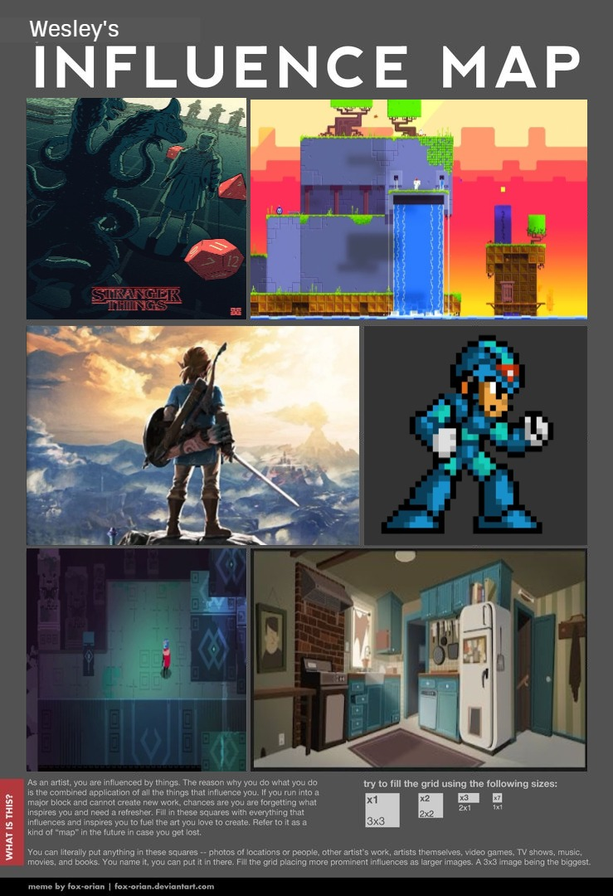

**THIS IS MY PORTFOLIO**

Nesta página tem todos (ou grande parte) os meus trabalhos no **Instituto Federal**

## Who the hell is me?

meu nome é wesley, sou um projeto de programador de jogos, tenho 17 anos mas finge-se que tenho 15. prefiro programar do que fazer arte.  
Meus jogos são feitos na plataforma Construct 2. Quando eu faço arte, geralmente é no Corel Draw. Também programo em C/C++.  
Contato: wesley.wmcc@hotmail.com  
Instagram: euwesleyc(www.instagram.com/euwesleyc)  
Facebook: @Deus me deu esta dádiva de nao utilizar essa rede social  
Twitter: nunca nem vi erresse  

# Portifolio

## Games
1. [$](wesleylandia.github.io/$) é um jogo em que um rapazinho que sai pela cidade coletando moedas e ao final o jogador terá de tomar uma decisão sobre isso.
2. [O Mistério da Casa 60](wesleylandia.github.io/Oficina2) é um jogo cheio de puzzles em que várias coisas se ligam com as outras.
3. [Warriors War](https://leonardofelipe.github.io/WarriorsWar/) é um jogo de estratégia em que voce tem de escolher os persoangens e as construções para lutar contra o adversario.
4. [Cuidado com a boca](wesleylandia.github.io/cuidedasuaboca) é um jogo de conscientização de cáries e problemas bucais.
## Artigos
Olha artigo, artigo mesmo, nao tem nenhum ate agora, eh isto.  

## Artes
nao tenho um estilo certo de arte porque nao tenho muita habilidade para isso mas:  

## Apresentações
Olha de apresentação mesmo, eu fui pra Santa Cruz e Parnamirim bater copo, nao sei se é valido. No campus, eu bati copo lá tambem (https://www.youtube.com/watch?v=Gy5uhUjbOJc), alem de ter feito algumas apresentações como Nolan Bushnell, Linus Torvalds, Sapo do Brejo e uns outros.

* * * 

eu acho que eh isto :)

XOXO.  

W.  

**ME CONTRATA EM NOME DE CRISTO REI**
